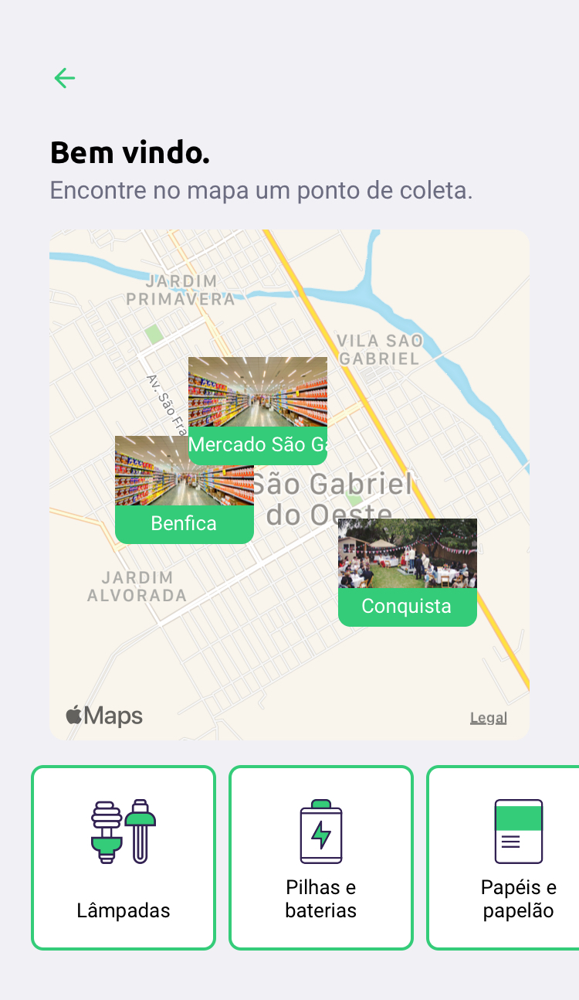

# Sobre o projeto
App desenvolvido com a finalidade de conectar empresas e pessoas com intuíto de auxiliar a sociedade no descarte de materiais.

App desenvolvido durante o evento Next Level Week da RocketSeat :rocket:

# Tecnologias utilizadas
- Node
- React
- React Native
- Typescript
- Expo
- Google Maps Api

# Instalação
1. Git clone neste repositório

# Backend
1. Acessar via terminar a pasta do projeto `cd nlw-ecoleta/backend`

2. Executar via terminal o comando `npm install` para instalar as dependências.

3. Executar via terminal o comando `npm run knex:migrate` para criar a base de dados.

4. Executar via terminal o comando `npm run knex:seed` para gerar os itens.

5. Executar via terminal o comando `npm run dev` para iniciar o servidor.

6. http://localhost:3333

# Frontend
1. Acessar a pasta do projeto `cd nlw-ecoleta/frontend`

2. Executar via terminal o comando `npm install` para instalar as dependências.

3. Executar via terminal o comando `npm run start` para iniciar o servidor.

4. http://localhost:3000

# Mobile
1. Acessar a pasta do projeto `cd nlw-ecoleta/mobile`

2. Executar via terminal o comando `npm install` para instalar as dependências.

3. Executar via terminal o comando `expo start` para iniciar a execução no Expo.

  
  

# Dúvidas?
:mailbox_with_no_mail:[Marcelo Bonilla](https://www.linkedin.com/in/marcelobonilla/)
